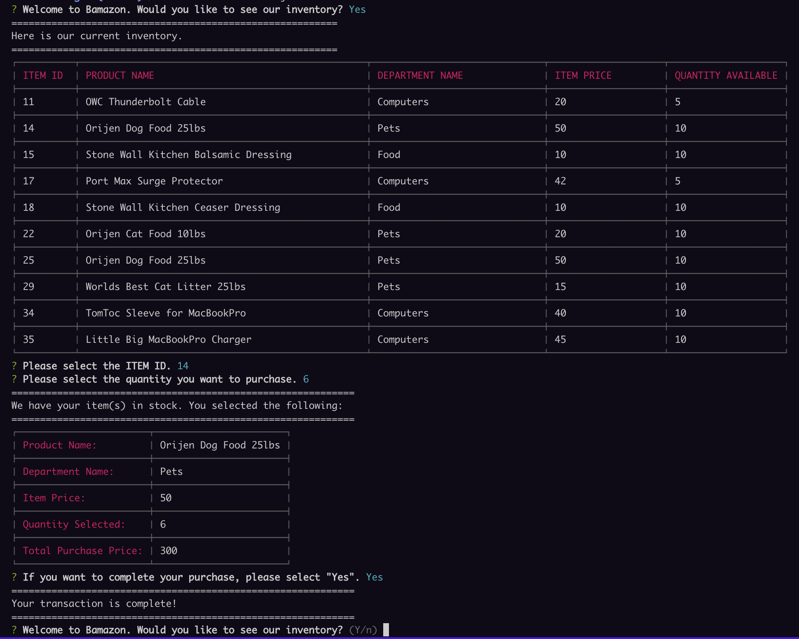

# Bamazon
Node.js and MySQL Homework Assignment

## Screen Shot of App Cycle:


## Link to full app demo on Github Pages:

https://olisun.github.io/Bamazon/index.html

## User Guide:

### Customer:
1. Select "Yes" to view the invetory.
2. Select the Item ID you like to purchase.
3. You will get a confirmation of your order.
4. Select "Yes" to confirm.
5. You will be taken back to the beginning of the cycle, however, you will see an updated inventory when the new product table is shown.

### Manager:
1. Select from the drop down menu.
2. Each selection you will have the option to select another item from the menu in the command line.
3. Add to inventory, select the Item ID and follow the questions.
4. Add a new product, pick a new item ID (should be 2 digits or less and not be a current product ID) and follow the questions.


## About the project:
We are tasked with creating an Amazon-like storefront with the MySQL, Node.js, JavaScript, npm Inquirer and MySql Workbench. The app will take in orders from customers and deplete stock from the store's inventory. Bonus tasks include tracking product sales across the store's departments and providing a summary of the highest-grossing departments in the store.

## MVP Objectives:

1. Create a MySQL Database called bamazon.

2. Create a Table inside of that database called products.

3. The products table should have each of the following columns:
   
    * item_id (unique id for each product)
    * product_name (Name of product)
    * department_name
    * price (cost to customer)
    * stock_quantity (how much of the product is available in stores)

4. Populate this database with around 10 different products. (i.e. Insert "mock" data rows into this database and table).

5. Then create a Node application called bamazonCustomer.js. Running this application will first display all of the items available for sale. Include the ids, names, and prices of products for sale.

6. The app should then prompt users with two messages.
   
    * The first should ask them the ID of the product they would like to buy.
    * The second message should ask how many units of the product they would like to buy.

7. Once the customer has placed the order, the application should check if the store has enough of the product to meet the customer's request.
  
    * If not, the app should log a phrase like Insufficient quantity!, the order will be prevented from going through.

8. However, if the store does have enough of the product, the app will fulfill the customer's order.
   
    * This means updating the SQL database to reflect the remaining quantity.
    * Once the update goes through, the customer will be shown the total cost of their purchase.

## Stretch Goals
  * Creating separate js files for Manager and Supervisor views mentioned in the About the Project section. I will try the manager one but I'm not sure If will be able to meet tomorrow's deadline.
  * Manager goal completed!

## Techology Stack:
  * Node.js
  * JavaScript
  * MySql Workbench
  * npm mysql
  * npm Inquirer
  * npm cli-table
  * Typed.js (for index.html jumbotron affect).

## Methodology:
I followed the class activites in node, inquirer and mysql and used them as guidelines. 

I created four functions. One which prompts the user to and triggers the second function which shows the product table. The third function does the transaction and shows the user her receipt. The final function updates the database and the user is taken back to the beginning. If the user selects "No" in any of the prompts, the connection is terminated.

I also installed a table library from npm called cli-table. It formats data into tables. I made a horizontal table for the main products inventory and an vertical table for the customer receipt.

Just completed the manager challange. I basically used the code from customer.js and changed the the logic and the variables. The way the functions were structured stay mostly similar.

## Problems That I Overcame:

My biggest challange was implementing the tables and getting the data properly appeneded to the tables. Much of it had to do with where I called the functions. Much of the boilerplate code was provided in the docs.

I also had some bugs initially updating the database after a completed transaction. I read threw the mysql docs to get the proper code structure and methods to update. I also remembered to convert the numbers to numbers with parseInt.

On manager, I had problems appending a new product row. I overcame this by studing the error messages and realized that I did not have a map from the item_id in the mysql db. To the function that was creating the new product.

## Problems Still Facing:

There is one bug I am still trying to solve and that is when the user selects an invalid item ID. The app does not recognize and will continue on, however, when it comes time to print up a receipt and update the DB, the app simply stalls.

## Code Snippets:

Creating the horizontal products table with cli-table.
```
  // Using cli-table's method to create a table (via constructor function). 
  var table = new Table({
    head: ['ITEM ID', 'PRODUCT NAME', 'DEPARTMENT NAME', 'ITEM PRICE', 'QUANTITY AVAILABLE'],
    colWidths: [10, 50, 30, 20, 20]
  });
```
```
    // looping through the array of objects from the response and pushing the values into the new table.
    for (var i = 0; i < response.length; i++) {
      table.push(
        [response[i].item_id, response[i].product_name, response[i].department_name, response[i].price, response[i].stock_quantity]
      );
    }
    // Calling on cli-table's method to console-log the table. 
    console.log(table.toString());
```
Creating the customer receipt using a vertical table.
```
    // Using cli-table's npm pacakge to create a transaction summary for the user. 
    var tableTwo = new Table();
```
```
    // cli-table doing it's magic.
          tableTwo.push(
            // This is a vertical table format. 
            { 'Product Name:': response[i].product_name }, { 'Department Name:': response[i].department_name }, { 'Item Price:': response[i].price }, { 'Quantity Selected:': userRespsonseTwo.numberOfItems }, { 'Total Purchase Price:': totalPurchasePrice });
          // Calling on cli-table's method to console-log the table. 
          console.log(tableTwo.toString());
```
Updating the inventory.
```
    // Updating the database with the new stock_quantity value after the purchase. 
          var newStockQuantity = parseInt(response[i].stock_quantity) - parseInt(userRespsonseTwo.numberOfItems);
          var userBoughtId = userRespsonseTwo.itemId;
```
```
      connection.query('UPDATE products SET ? WHERE ?', [
          //
          {
            stock_quantity: newStockQuantity
          },
          {
            item_id: userBoughtId
          }
        ],
        function(error, response) {
          if (error) throw error;
        });
```
Adding a new product as a manager.
```
 connection.query('INSERT INTO products SET ?',
      // passing an the new product info (as an object) as an argument in the comnnection.query method. 
      {
        item_id: managerResponse.itemID,
        product_name: managerResponse.product,
        department_name: managerResponse.department,
        price: managerResponse.price,
        stock_quantity: managerResponse.quantity
      },
```

## Link to my Portfolio Page on Github where this app is listed in the portfolio section.

https://olisun.github.io/Updated-Portfolio-Page/

## You can also reach me on LinkedIn.
https://www.linkedin.com/in/oliver-sun-4b6baba/